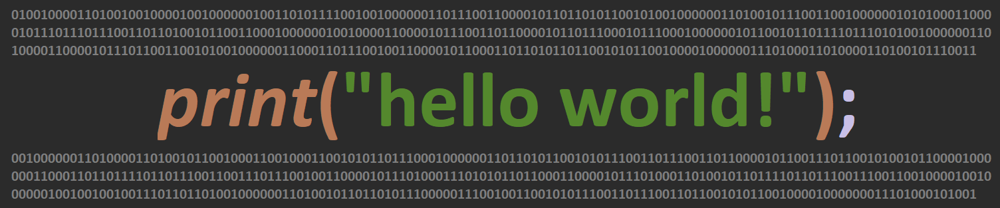

## Get to know me better!
- :mortar_board: I’m a 4th year Computer Engineering student from The University of British Columbia
- :computer: I have worked at Unity Technologies as a Software Developer and at Microchip Technology as a Product Design Engineer during my Co-op work terms
- :mag: I am currently searching for full-time opportunities in Software Engineering
- 💬 Ask me about programming, video games, anime, movies!
- 📫 How to reach me: You can contact me at my email: tawsifhasan1998@gmail.com

## Here are some of my GitHub stats

## Here are some developent tools I worked with :smile:!

Software Languages:

  
  
  
  
  
  
  

Hardware Description Languages and Low Level Languages:

  
  
  
  

Version Control:

  
  
  
  

Hosting/SaaS:

  
  
  

Databases:

  
  

CI:

  

Operating Systems:

  
  
  

